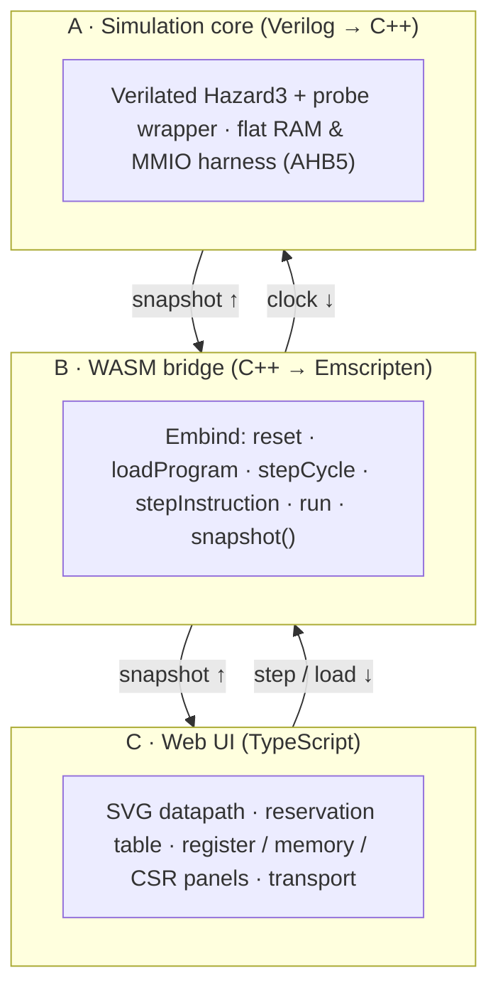
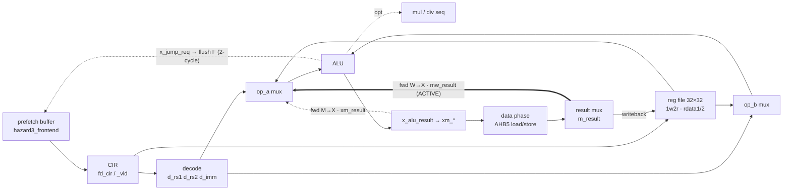

# Hazard3 Visualizer — Design Proposal

An in-browser, cycle-accurate teaching tool that runs the **real Hazard3 RISC-V
core** in WebAssembly and animates its live microarchitectural state onto an
interactive SVG datapath.

> **Status:** design for review — no implementation yet.
> A rendered version of this document (with the datapath mock) is published as an
> Artifact for review; this file is the tracked source of truth.

| | |
|---|---|
| **Core** | Hazard3 RV32 (3-stage), the core shipping in the RP2350 / Pico 2 |
| **Sim** | Verilator → C++ |
| **Runtime** | Emscripten / WebAssembly |
| **UI** | SVG + TypeScript, fully client-side |
| **Audience** | Undergraduate ECE |

---

## 1. What we're building & why

A student steps a real program through a real production core and *sees* the
pipeline: which instruction sits in each stage, when a result is forwarded
instead of read from the register file, why a load forces a bubble, and how a
taken branch flushes the front end.

Block-diagram slides are static and toy simulators are fiction. This tool is
neither: it drives the **actual Hazard3 RTL** — the same core shipping in the
RP2350 / Raspberry Pi Pico 2 — so what students watch is what the silicon does,
cycle for cycle. The payoff is that hazards, forwarding, and stalls stop being
vocabulary and become things you can point at.

**Pedagogical stance.** Show the *true 3-stage core*, but scaffold from what
students already know. An optional overlay maps Hazard3's `F / X / M` onto the
canonical textbook 5-stage `IF·ID·EX·MEM·WB`, so a class taught the
Patterson & Hennessy pipeline first can see where the real core fuses stages —
that mapping is itself a teaching moment.

---

## 2. System architecture

Three layers with one narrow, well-typed seam between them: a **state
snapshot**. The simulation never talks to the DOM; the UI never touches
Verilator. That seam is what keeps the project buildable in phases and swappable
at the bottom.



The snapshot is the contract. Because layer A hides behind it, we can swap the
Verilator backend for CXXRTL (§10) without the UI noticing.

- **A · Sim core** — Verilated Hazard3 plus a tiny C++ harness that answers its
  two AHB5 ports from a flat RAM, with an MMIO window for `putchar`/exit.
  Deterministic; no OS, no files.
- **B · Bridge** — a thin C++ facade compiled to WASM via Embind. Drives the
  clock and marshals a curated set of internal signals into one JSON-able
  snapshot per query.
- **C · Web UI** — pure client-side. Reads snapshots, writes them onto SVG
  elements by `id`, and offers step / run / breakpoint controls plus the example
  gallery.

---

## 3. The core we're visualizing

Hazard3 is a compact 3-stage in-order machine. Getting the stages right matters —
the whole tool is a window onto this exact structure, so the diagram must be
Hazard3, not a generic RISC pipeline.

The three stages are **F (fetch)**, **X (decode + execute)**, and **M (memory +
writeback)**. Note what that fuses: decode is *combinational inside X* — there is
no separate decode pipeline register the way the textbook 5-stage has. The
pipeline registers are the fetched-instruction latch `fd_cir` at the F│X boundary
and the `xm_*` group at the X│M boundary.



Module and signal names above are taken from the Hazard3 RTL
(`hazard3_core`, `hazard3_frontend`, `hazard3_decode`, `hazard3_regfile_1w2r`,
`hazard3_alu`, `hazard3_muldiv_seq`, `hazard3_csr`).

### What the core exposes, and what it means on screen

Each visible phenomenon is backed by concrete signals we probe, paired with an
example program (§7) chosen to trigger exactly that behavior. **This table is the
spine of the whole project** — it ties RTL to pixels to pedagogy.

| Phenomenon | Hazard3 mechanism | Signals probed | Trigger program |
|---|---|---|---|
| **Operand forwarding** | Bypass mux in X selects an in-flight result over the register read | `x_rs1_bypass` `x_rs2_bypass` `xm_result` `mw_result` | Back-to-back dependent `add`s |
| **Load-use interlock** | X stalls one cycle when a consumer needs a load result not yet available | `x_stall` `xm_memop` `m_dphase_in_flight` | `lw` then dependent `add` |
| **Branch / jump penalty** | 2-cycle feedback loop: address issue in X flushes the front end in F | `x_jump_req` `f_jump_req/_rdy` `fd_cir_vld` | Taken branch inside a loop |
| **Multi-cycle mul/div** | Sequential unit holds X until the result is valid | `x_stall_muldiv` `x_muldiv_result_vld` | `mul` / `div` sequence |
| **Trap / IRQ entry** | Pipeline flush and redirect to the trap vector | `m_trap_enter_vld` `m_trap_addr` `m_trap_is_irq` | `ecall` · timer interrupt |
| **CSR access** | Read / modify sequenced across X→M | `d_csr_ren` `d_csr_wen` `x_csr_rdata` | `csrr` / `csrw mstatus` |
| **Bus wait state** | Data phase not ready — M stalls the whole pipe | `bus_dph_ready_d` `m_bus_stall` | Load from a slow region |

---

## 4. Getting state out of the model — the crux

This decision shapes everything above it. A Verilated model is optimized C++;
its internal wires aren't ordinarily reachable from outside. Four ways to open a
window, weighed for a teaching tool that must stay maintainable against an
upstream core we don't own.

| Option | How | Cost / risk |
|---|---|---|
| **A · `--public-flat-rw`** | One flag makes every wire reachable via `rootp` | No RTL edits, but mangled names, model bloat, lost optimizations, names that drift with config |
| **B · Selective pragmas** | `/*verilator public*/` on a chosen signal list | Clean and cheap, but edits live *inside* upstream RTL — a patch to rebase on every Hazard3 update |
| **C · Probe wrapper** ✅ | A small module *we* own pulls signals up by hierarchical reference and marks them public | Upstream stays pristine; all coupling sits in one file we maintain |
| **D · CXXRTL backend** | Yosys' C++ backend; every wire is introspectable by name at runtime | Purpose-built for this, ships with Hazard3 — but changes the toolchain you already have working |

**Recommendation: Option C, a probe wrapper.** One file — `hazard3_probe.svh` —
reaches into the core by hierarchical name (`u_core.x.d_pc`,
`u_core.x.xm_result`, …) and re-exports each as a `public` wire. Hazard3 stays an
untouched submodule; the fragile coupling to internal names is quarantined in
code we control and can diff against a pinned commit. The snapshot builder (§5)
reads only from the probe, so renaming an upstream signal breaks one file,
loudly, at build time.

**Worth a half-day spike — CXXRTL (Option D).** Its `debug_items` interface
exposes *every* wire by hierarchical string name with zero RTL edits;
introspection is the entire point of the backend, which is exactly our problem.
Hazard3 already ships a CXXRTL testbench, and CXXRTL output is plain C++ that
Emscripten compiles like any other. The only reason to prefer Verilator is that
**you already have Verilator→WASM working** — a genuine advantage, but one worth
pressure-testing against a backend built for observability. See §10.

---

## 5. The WASM bridge & the snapshot

A deliberately small surface. The UI drives the clock and asks for state; it
never reaches into the model. Everything crossing the boundary is plain data, so
the JS side needs no knowledge of Verilator internals.

### Control surface (Embind)

```cpp
// compiled to hazard3.wasm + ES module glue
class Sim {
  void   reset();
  void   loadProgram(val bytes, uint32 baseAddr);  // Uint8Array → RAM (no filesystem)
  void   stepCycle();                // advance one posedge
  int    stepInstruction();          // run until one instruction retires
  RunStop run(uint32 maxCycles, uint32 breakPC);   // → {reason, cycles}
  val    snapshot();                 // → JS object, the seam
  uint32 readMem(uint32 addr);
  void   writeMem(uint32 addr, uint32 data);
};
```

### The snapshot (one object per query)

```jsonc
Snapshot {
  cycle, retired,
  F: { fetchPC, cir, cirValid, is32bit },
  X: { pc, instr, disasm, rd, rs1, rs2, imm, aluOp,
       opA, opB, aluResult, jumpReq,
       stall, stallReason, bypassA, bypassB },   // bypass* ∈ {none, M, W}
  M: { pc, instr, rd, result, memOp, busAddr, busData,
       stall, trapEnter, trapAddr },
  regs: [32],  regWrite: { en, addr, data },
  csr:  { mstatus, mepc, mcause, mtvec, mcycle, minstret },
  bus:  { i:{addr,phase}, d:{addr,write,data,phase} }
}
```

**Disassembly** is produced UI-side by a small RV32 decoder keyed on the
instruction word, cross-checked against the core's own `d_aluop`/`d_memop` so the
mnemonic shown always agrees with what the hardware decoded. **Retirement** —
needed for `stepInstruction` and the `retired` counter — is detected from a
valid, non-flushed instruction leaving M (mirroring the core's `minstret`
increment), which is also the honest definition of "one instruction done."

**Performance.** The model steps in the MHz range in WASM — far faster than
anyone reads. So we don't render every cycle: single-step redraws immediately;
*run mode* executes to a breakpoint or cycle budget and paints only the final
state, keeping a short ring buffer of recent snapshots to feed the reservation
table without re-simulating.

---

## 6. The visualization

One screen, four coordinated views over a single snapshot, plus a transport. The
datapath answers "what is happening right now"; the reservation table answers
"how did we get here."

- **Datapath** — the §3 SVG, authored once with a stable `id` per element. Each
  frame writes instruction text into stage boxes, sets `data-active` on live
  wires (amber), and dims overridden reads. Bubbles and flushes get their own
  visual state.
- **Reservation table** — the space-time grid (instructions × cycles) drawn from
  the snapshot ring buffer. The single clearest way to *see* a stall push
  everything behind it.
- **Register file** — 32 registers with ABI names; the destination just written
  flashes; sources read this cycle are outlined. Hex/decimal/signed toggle.
- **Memory · CSR · disasm** — a program listing with the three stage-PCs marked
  in place, a memory/bus strip showing the live AHB transaction, and key CSRs
  (`mcycle`, `mstatus`, …).

### Reservation table — how a stall reads (illustrative)

```
                c1  c2  c3  c4  c5  c6  c7
lw  x5, 0(x2)   F   X   M
add x6, x5, x1      F   ⟂   X   M          ⟂ = load-use interlock bubble
or  x7, x6, x1          F   ⟂   X   M
sub x8, x1, x1              F   F   X   M
```

The live tool renders these cells from actual per-cycle stage occupancy, so exact
bubble counts follow the real core. The point students take away: one load-use
stall ripples down every row behind it.

### Transport & interaction

- **Step cycle · step instruction · run · pause · reset**, with adjustable run
  speed for "animate slowly" lectures.
- **Breakpoints** on PC (click the listing) and optional watch on "next stall /
  next branch / next trap" so an instructor can jump straight to the phenomenon.
- **Guided tours** — each example (§7) can ship a scripted sequence of captions
  pinned to cycles: "now watch `x6` arrive by forwarding, one cycle before the
  register file would have it."
- **Hover any wire or box** for the underlying signal name and value — turning
  the picture into a glossary.

**Frontend stack.** Recommend **vanilla TypeScript with a tiny reactive render
loop** (or Svelte) over React. This is a state-driven-SVG app, not a component
tree; hand DOM/attribute updates keyed by `id` are simpler, smaller, and animate
more predictably than a virtual DOM diff over hundreds of SVG nodes. The bundle
stays tiny, which matters when we're already shipping a WASM core.

---

## 7. Example programs

The curriculum lives here. Each example is a few instructions engineered to make
one microarchitectural phenomenon unmistakable — the smallest program that forces
the core to show its hand.

- **Forwarding chain** — dependent `add`s so every operand comes from a bypass;
  watch the register file go quiet.
- **Load-use** — `lw` feeding the next instruction; the one bubble the forwarding
  network can't erase.
- **Branchy loop** — a counted loop so the front-end flush and its 2-cycle
  penalty recur predictably.
- **Multiply/divide** — the sequential unit parking X for several cycles.
- **Trap** — `ecall` or a timer IRQ redirecting to a handler.
- **Memcpy / dot-product** — a "real" kernel that braids all of the above.

Programs are authored in assembly (or small C), built **at CI time** with the
RISC-V GCC toolchain, and the resulting `.hex` images are checked in — so the
site stays a static bundle with no toolchain needed to run it. An in-browser
assembler is a tempting v2, not a v1 dependency.

---

## 8. Build pipeline & the known workarounds

Verilog → C++ → WASM, in two clean stages. The Emscripten step is where the
"small workarounds" live — here they are, named, so they're a checklist and not a
surprise.

```bash
# 1 · Verilate the core + our probe → C++ (no VCD in the browser build)
verilator --cc --Mdir build/obj -O2 \
  -Ithird_party/hazard3/hdl hazard3_top.v hazard3_probe.svh

# 2 · Compile Verilated model + harness + bridge → WASM/ES module
em++ build/obj/*.cpp $VERILATOR_ROOT/include/verilated.cpp \
  sim/harness.cpp sim/bridge.cpp --bind -O2 \
  -sMODULARIZE -sEXPORT_ES6 -sALLOW_MEMORY_GROWTH -sENVIRONMENT=web \
  -o web/public/hazard3.js
```

- **Program load, not files** — replace any `$readmemh`/file path with the
  bridge's `loadProgram()` writing straight into the C++ RAM array; sidesteps the
  Emscripten virtual filesystem entirely.
- **No threads** — don't pass Verilator `--threads`; keep the runtime
  single-threaded so there's no pthread / SharedArrayBuffer / COOP-COEP
  dependency for a static host.
- **Tame `$finish`/`$fatal`** — override Verilated's `vl_finish` / `vl_stop` /
  `vl_fatal` to set a status flag instead of `abort()`-ing the WASM instance;
  surface it as a run-stop reason.
- **Memory & opt** — `ALLOW_MEMORY_GROWTH` for the RAM + model; `-fexceptions`
  for Embind; trace/VCD stays *off* in-browser (a signal ring buffer replaces
  it).

---

## 9. Repository layout & phased plan

```
hazard3-visualizer/
├─ third_party/hazard3/     # pinned submodule — never edited
├─ rtl/  hazard3_top.v  hazard3_probe.svh    # our wrapper + probe (§4)
├─ sim/  harness.cpp  memory.cpp  bridge.cpp # AHB RAM + Embind (§5)
├─ web/  src/  svg/datapath.svg  public/     # TypeScript UI (§6)
├─ programs/  *.S  *.hex  build.mk           # examples (§7)
├─ scripts/  verilate.sh  embuild.sh
└─ docs/  design.md
```

| Milestone | Deliverable | Exit criterion |
|---|---|---|
| **M0 · Native spike** | Verilated Hazard3 + flat RAM in a plain C++ main; run one `.hex` to completion, print PC per cycle | A known-good instruction trace |
| **M1 · Probe + snapshot** | Probe wrapper + snapshot builder; assert snapshot against the M0 trace | Validated `snapshot()` in native C++ |
| **M2 · Cross to WASM** | Emscripten build; throwaway page loads a program, steps, dumps snapshot to console | Core runs in the browser (proves §8) |
| **M3 · Datapath online** | Wire SVG to snapshot: stage text, active-path highlight, bubble/flush | Animated single-stepping — first moment it teaches |
| **M4 · Panels + transport** | Reservation table, register/memory/CSR panels, run/step/breakpoint | A usable lab tool |
| **M5 · Curriculum + polish** | Example gallery, guided tours, accessibility pass, static deploy (GitHub Pages) | Shippable to a class |

---

## 10. Open decisions

Six calls worth a read before any code. A recommendation is marked for each, but
each is genuinely yours — they shape scope and the student experience.

1. **Backend** — stay **Verilator** (you have it working) or spike **CXXRTL** for
   its free introspection? *Rec: keep Verilator, but budget the half-day CXXRTL
   spike in M0 — observability is the whole game.*
2. **Core config** — which Hazard3 feature set? Full `RV32IMACZb*` is visual
   noise for teaching. *Rec: start **RV32IM** (forwarding + load-use + mul/div
   stalls), add **C** later; leave A/PMP/debug off.*
3. **Framing** — show only the true 3-stage core, or also the **5-stage overlay**
   for classes taught the textbook pipeline first? *Rec: build the real core; add
   the overlay as a toggle.*
4. **Frontend** — **vanilla TS** / Svelte vs React. *Rec: vanilla TS or Svelte —
   it's a state-driven SVG, not a component tree.*
5. **Programs** — curated prebuilt `.hex` only, or an **in-browser
   assembler/editor**? *Rec: curated for v1; editor is v2.*
6. **Scope of v1** — where's the line for a first classroom-usable release?
   *Rec: through M4 + the first three examples; treat M5 curriculum as ongoing.*

**Next step.** Confirm the direction (or answer the questions above) and the
first code drop is the repo scaffold — submodule pin, probe wrapper, and the M0
native spike — proving the core runs and the trace is trustworthy before a single
pixel is drawn.
